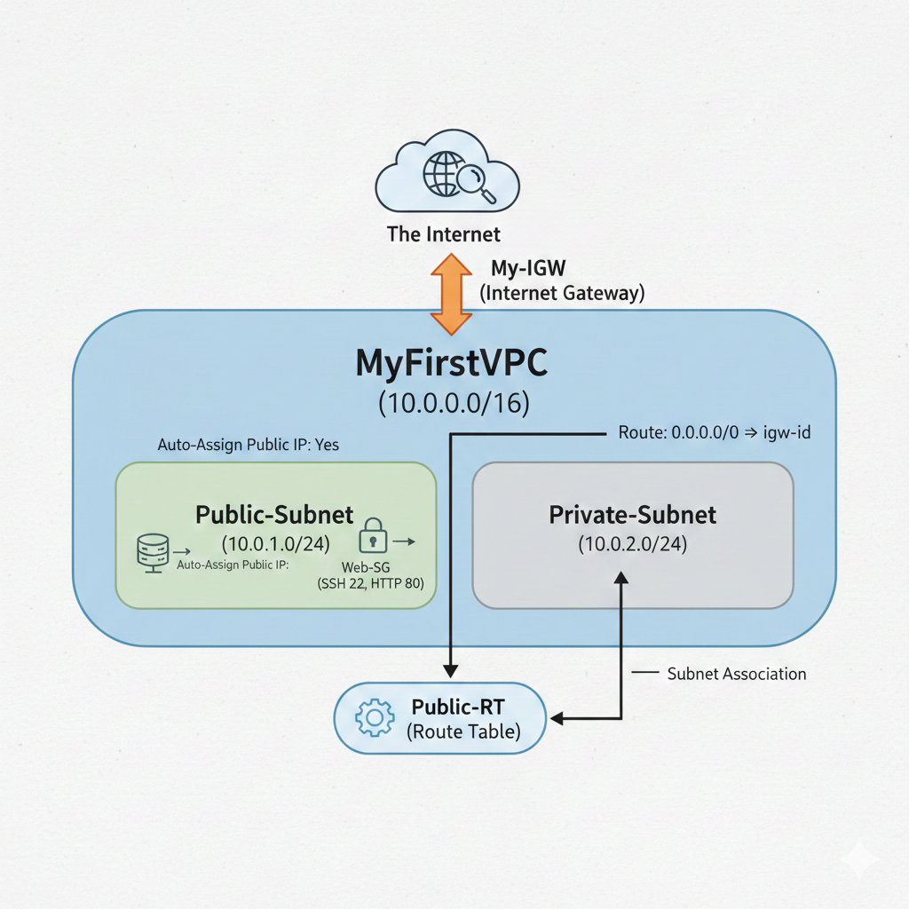
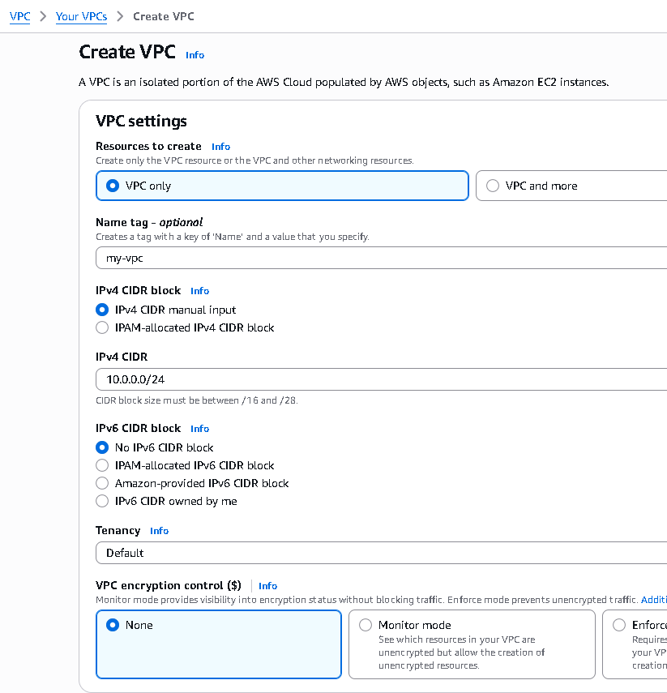
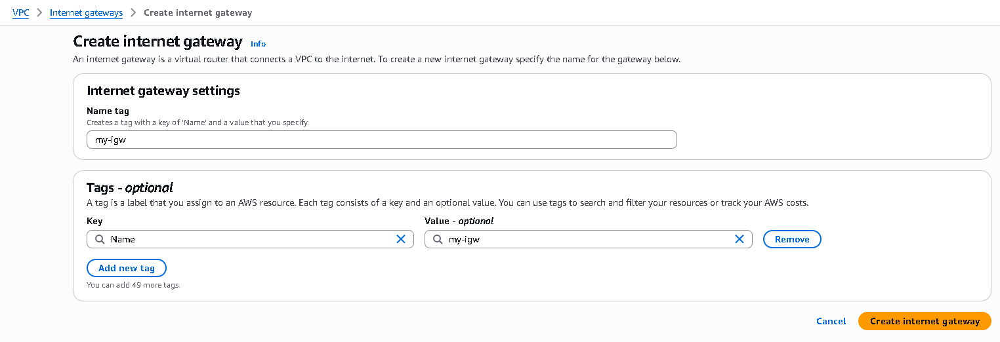
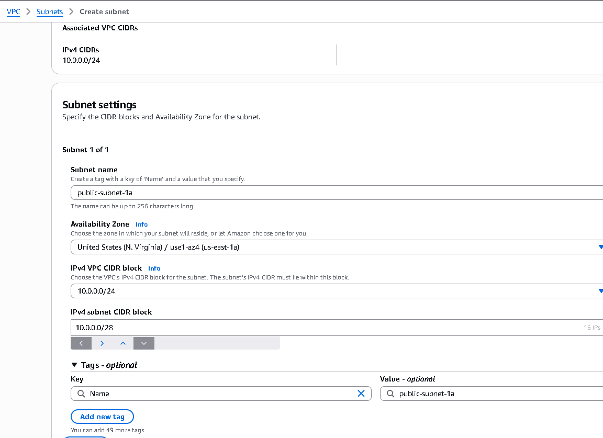
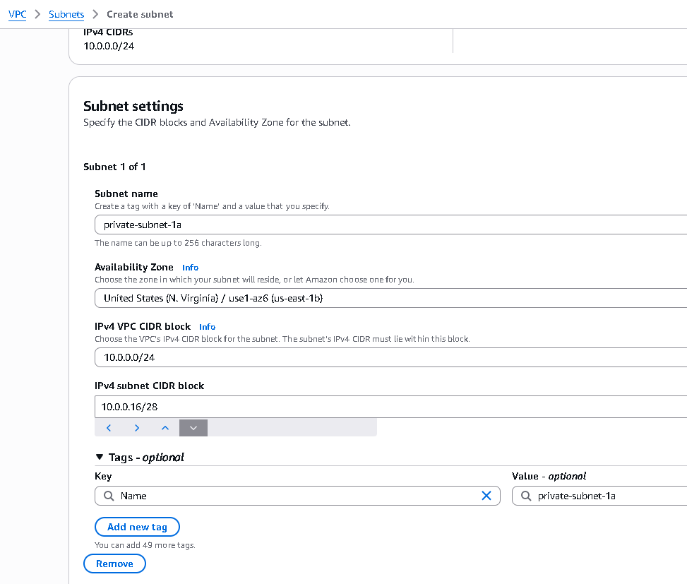
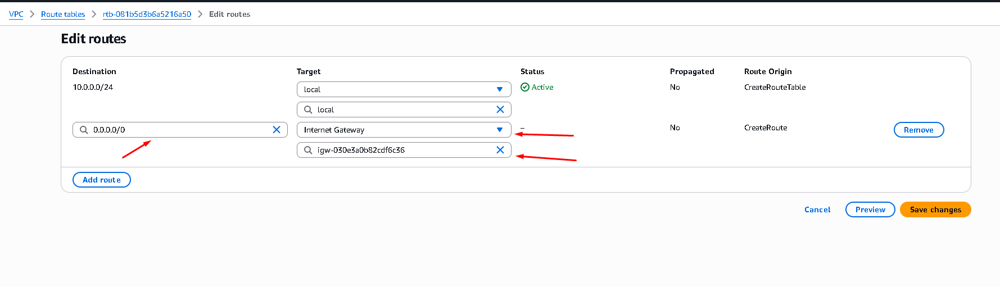
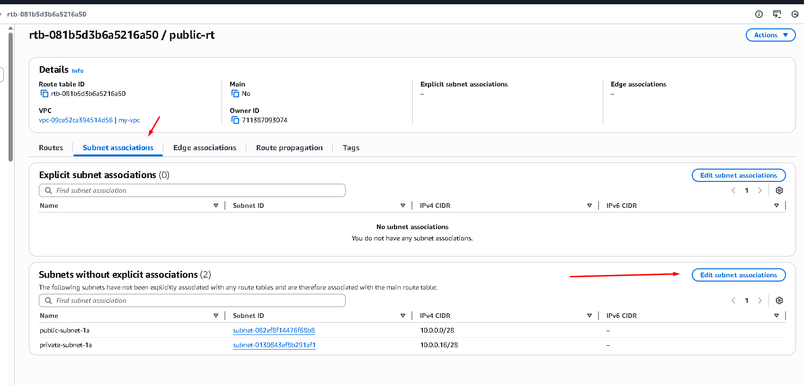
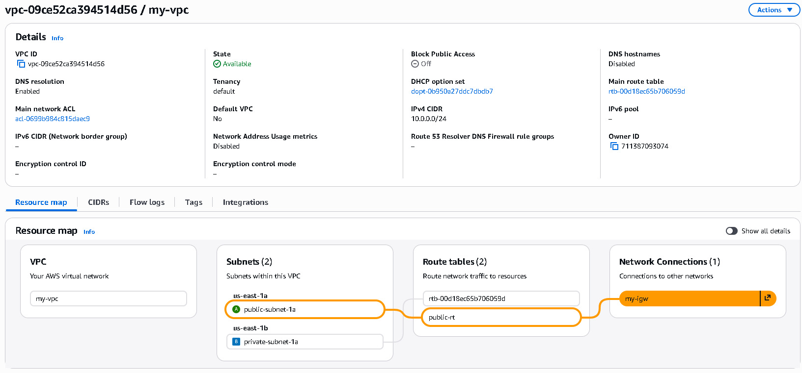
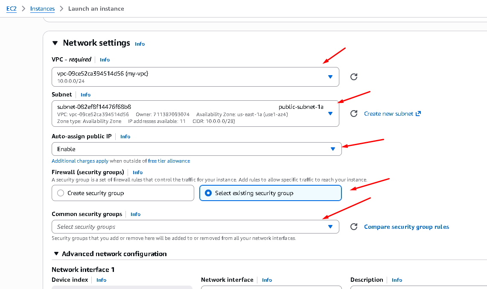

# Complete AWS VPC Setup Guide - Step by Step

This guide walks you through creating a VPC with 2 subnets, a route table, an Internet Gateway, and a security group using the AWS Management Console.

---

## Prerequisites
- AWS Account (free tier eligible)
- Access to AWS Management Console
- Basic understanding of networking concepts

---

## Architecture Overview



---

## Step 1: Create a VPC

### 1.1 Navigate to VPC Dashboard
- Open AWS Management Console
- Search for **VPC** in the search bar
- Click on **VPC** from the results

### 1.2 Create VPC
- In the left sidebar, click **Your VPCs**
- Click the **Create VPC** button (top right)

### 1.3 Configure VPC Settings
- **Name tag**: Enter `my-vpc` (or your preferred name)
- **IPv4 CIDR block**: Enter `10.0.0.0/28`
- **IPv6 CIDR block**: Select **No IPv6 CIDR block**
- **Tenancy**: Keep as **Default**
- Click **Create VPC**

Your VPC is now created!

---



## Step 2: Create Internet Gateway (IGW)

### 2.1 Navigate to IGW Settings
- In the VPC dashboard left sidebar, click **Internet Gateways**
- Click **Create Internet Gateway**

### 2.2 Configure IGW
- **Name tag**: Enter `my-igw` (or your preferred name)
- Click **Create Internet Gateway**




### 2.3 Attach IGW to VPC
- You'll see a green banner saying "Internet gateway created"
- Click the **Attach to VPC** button or open the new create Internet Gateway > Actions > **Attach to VPC**
- From the dropdown, select your VPC (`my-vpc`)
- Click **Attach Internet Gateway**

 Your Internet Gateway is now attached to your VPC!

---


## Step 3: Create Subnets

### 3.1 Create Public Subnet

#### Navigate to Subnets
- In the VPC dashboard left sidebar, click **Subnets**
- Click **Create Subnet**

#### Configure Public Subnet
- **VPC ID**: Select your VPC (`my-vpc`)
- **Subnet name**: Enter `public-subnet-1a`
- **Availability Zone**: Select any zone (e.g., `us-east-1a`)
- **IPv4 CIDR block**: Enter `10.0.0.0/28`
- Click **Create Subnet**

 Public subnet created!



### 3.2 Create Private Subnet

#### Create Another Subnet
- Click **Create Subnet** again
- **VPC ID**: Select your VPC (`my-vpc`)
- **Subnet name**: Enter `private-subnet-1a`
- **Availability Zone**: Select the same or different zone
- **IPv4 CIDR block**: Enter `10.0.0.16/28`
- Click **Create Subnet**

 Private subnet created!

---



## Step 4: Create Route Tables

### 4.1 Create Public Route Table

#### Navigate to Route Tables
- In the VPC dashboard left sidebar, click **Route Tables**
- Click **Create Route Table**

#### Configure Public Route Table
- **Name**: Enter `public-rt`
- **VPC**: Select your VPC (`my-vpc`)
- Click **Create Route Table**

### 4.2 Add Internet Gateway Route to Public Route Table

#### Add Route
- In the Route Tables list, select your public route table (`public-rt`)
- Click on the **Routes** tab
- Click **Edit Routes**
- Click **Add Route**
- **Destination**: Enter `0.0.0.0/0` (all traffic to internet)
- **Target**: Select **Internet Gateway** from the dropdown
- Select your IGW (`my-igw`) from the list
- Click **Save Routes**

Public route table now routes traffic to IGW!


### 4.3 Associate Public Subnet with Public Route Table

#### Associate Route Table
- Go to the Route table and click on **Subnet Associations** tab
- Click **Edit Subnet Associations**

- Check the box next to your public subnet (`public-subnet-1a`)
- Click **Save Associations**

Public subnet is now associated with the public route table!
---

Go back to your VPC  and change the Resource map



## Step 5: Create Security Groups

### 5.1 Create Security Group for Public Subnet

#### Navigate to Security Groups
- In the VPC dashboard left sidebar, click **Security Groups**
- Click **Create Security Group**

#### Configure Security Group
- **Security group name**: Enter `public-sg`
- **Description**: Enter `Security group for public subnet`
- **VPC**: Select your VPC (`my-vpc`)
- Click **Create Security Group**

### 5.2 Add Inbound Rules

#### Add HTTP Access
- You'll be taken to the security group details page
- Click the **Inbound Rules** tab
- Click **Edit Inbound Rules**
- Click **Add Rule**

**Rule 1 - HTTP:**
- **Type**: Select **HTTP**
- **Protocol**: Auto-filled as **TCP**
- **Port range**: Auto-filled as **80**
- **Source**: Select **Anywhere-IPv4** (0.0.0.0/0)
- Click **Add Rule**

**Rule 2 - HTTPS:**
- **Type**: Select **HTTPS**
- **Protocol**: Auto-filled as **TCP**
- **Port range**: Auto-filled as **443**
- **Source**: Select **Anywhere-IPv4** (0.0.0.0/0)
- Click **Add Rule**

**Rule 3 - SSH (for management):**
- **Type**: Select **SSH**
- **Protocol**: Auto-filled as **TCP**
- **Port range**: Auto-filled as **22**
- **Source**: Select **Anywhere-IPv4** (0.0.0.0/0) OR your IP for security
- Click **Add Rule**
- Add any other rule you think is necessary like your application port
- Click **Save Rules**

### 5.3 Create Security Group for Private Subnet (Optional but recommended)

#### Create Another Security Group
- Click **Create Security Group**
- **Security group name**: Enter `private-sg`
- **Description**: Enter `Security group for private subnet`
- **VPC**: Select your VPC (`my-vpc`)
- Click **Create Security Group**

#### Add Inbound Rules for Private SG
- Select the private security group (`private-sg`)
- Click **Edit Inbound Rules**
- Click **Add Rule**

**Rule - Allow traffic from Public Subnet:**
- **Type**: Select **All TCP**
- **Source**: Enter `10.0.1.0/24` (your public subnet CIDR)
- Click **Save Rules**

 **Security groups created with appropriate rules!**

---

## Step 6: Verification Checklist

Use this checklist to verify everything is set up correctly:

- [ ] VPC created with CIDR `10.0.0.0/24`
- [ ] Internet Gateway created and attached to VPC
- [ ] Public subnet created with CIDR `10.0.0.0/28`
- [ ] Private subnet created with CIDR `10.0.0.16/28`
- [ ] Public route table created with route to IGW (`0.0.0.0/0 → IGW`)
- [ ] Public subnet associated with public route table
- [ ] Private route table created (optional)
- [ ] Private subnet associated with private route table
- [ ] Public security group created with HTTP, HTTPS, SSH rules
- [ ] Private security group created (optional)

---

## Step 7: Testing Your Setup- Create EC2 with the Subnet and security group

### Launch an EC2 Instance in Public Subnet
1. Go to **EC2 Dashboard**
2. Click **Launch Instance**
3. Under **Network Settings**, edit and select your VPC and public subnet
4. Select your public security group, ensure you enable public IP
5. Once running, the instance should have internet access



### To SSH into your instance:
```bash
ssh -i your-key.pem ec2-user@your-instance-public-ip
```

---

## Common Issues & Troubleshooting

### Issue: Instance can't reach the internet
- **Check**: Subnet has internet access (route to IGW)
- **Check**: Security group allows outbound traffic for the specific port (port 22, http port application port)
- **Check**: Instance has public IP assigned

### Issue: Can't connect to EC2 via SSH
- **Check**: Security group allows port 22 (SSH)
- **Check**: Your IP is allowed in the SSH rule
- **Check**: You're using the correct key pair

### Issue: Route table changes not taking effect
- **Solution**: Refresh the console and check associations again

---


## Reference Links

- [AWS VPC Documentation](https://docs.aws.amazon.com/vpc/)
- [VPC Best Practices](https://docs.aws.amazon.com/vpc/latest/userguide/VPC_Security.html)
- [Security Groups Guide](https://docs.aws.amazon.com/vpc/latest/userguide/VPC_SecurityGroups.html)